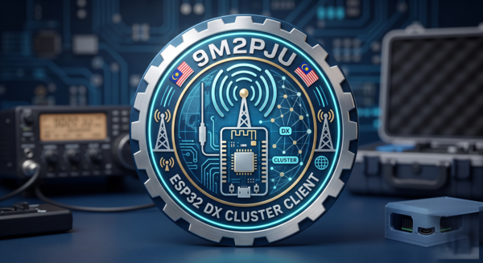

# 9M2PJU ESP32 DX Cluster Client

<p align="center">
  
</p>

> A single firmware that runs on **13 popular ESP32 boards with a built-in
> screen and Wi-Fi**, connects to any DXSpider-compatible DX cluster over
> telnet, and shows live DX spots on the display — no computer required.

[](https://github.com/9M2PJU/9M2PJU-ESP32-DX-Cluster-Client/actions/workflows/build-flash.yml)
[](https://9m2pju.github.io/9M2PJU-ESP32-DX-Cluster-Client/)

---

## What is this?

A DX Cluster is a real-time network of servers that relay "spots" — reports of
rare or interesting amateur radio activity — to connected operators. Spots
follow the format:

```
DX de 9M2XYZ:    14.074  JA1ABC     FT8, strong signal in Europe    1234Z
```

This project turns an ESP32 board with a screen into a **standalone DX Cluster
client**. You flash it, configure it via a web page on your phone, and it sits
on your desk (or wrist) showing live DX spots as they come in.

It is the companion client for the
[9M2PJU DXSpider Docker](https://github.com/9M2PJU/9M2PJU-DXSpider-Docker)
node, but works against **any** DX cluster that speaks the standard telnet
protocol on port 7300 (DXSpider, CC Cluster, AR-Cluster, etc.).

---

## Key features

- **Web Flasher** — install firmware directly from your browser (Chrome/Edge)
  via Web Serial. No software to install, no drivers, no PlatformIO. Just
  plug in USB and click a button. Hosted on GitHub Pages.

- **Built-in Web Admin UI** — configure Wi-Fi, callsign, cluster server, and
  more from a captive portal on your phone. No source code editing, no USB
  connection needed after the first flash. Settings are stored in NVS
  (non-volatile storage) and survive reboots and firmware updates.

- **13 boards supported** out of the box — LilyGO T-Display-S3, T-Display,
  T-QT, T-HMI, T-Watch 2020, T-Watch S3, T-Deck, M5Stack Core/Core2,
  M5StickC Plus, Sunton CYD, Waveshare S3 Round, and the T-Display-S3 AMOLED.
  See the [supported boards table](#supported-boards).

- **Adaptive UI** — large panels (320px+) show a scrolling spot list with
  frequency, callsign, spotter, and comment. Small/round panels show a
  compact single-spot view with a connection ring. The display title shows
  "9M2PJU DX Cluster Client" on all screens.

- **Button command menu** — press the BOOT button to open a menu of common
  DX cluster commands (`sh/dx`, `sh/wwv`, `sh/u`, `sh/c`, etc.). Tap to
  cycle, hold to send. Response text is displayed on screen.

- **Automatic reconnect** for both Wi-Fi and telnet. If your Wi-Fi drops or
  the cluster server restarts, the device reconnects automatically.

- **UTC clock** synced via NTP, displayed in the header bar.

- **Band colour coding** — spot frequencies are colour-coded by band for
  quick visual scanning.

- **Captive portal** — when you connect to the device's setup Wi-Fi, the
  configuration page pops up automatically on most phones. No need to
  type an IP address.

---

## Supported boards

One PlatformIO environment per board. Pick the one that matches your hardware.

| Environment (`-e`) | Board | Display | Chip | Resolution |
| :--- | :--- | :--- | :--- | :--- |
| `lilygo-tdisplay-s3` | LilyGO T-Display-S3 | 1.9" ST7789 (parallel) | ESP32-S3 | 320x170 |
| `lilygo-tdisplay-s3-amoled` | LilyGO T-Display-S3 AMOLED | 1.91" RM67162 (QSPI) | ESP32-S3 | 536x240 |
| `lilygo-tdisplay` | LilyGO T-Display | 1.14" ST7789 (SPI) | ESP32 | 240x135 |
| `lilygo-t-qt` | LilyGO T-QT | 0.8" GC9A01 (SPI) | ESP32-S3 | 128x128 |
| `lilygo-t-hmi` | LilyGO T-HMI | 2.4" ILI9341 (SPI) | ESP32-S3 | 320x240 |
| `m5stickc-plus` | M5Stack StickC Plus / Plus2 | 1.14" ST7789 (SPI) | ESP32-PICO | 240x135 |
| `m5stack-core` | M5Stack Basic / Core / Fire | 2.0" ILI9341 (SPI) | ESP32 | 320x240 |
| `m5stack-core2` | M5Stack Core2 / CoreS3 | 2.0" ILI9341 (SPI) | ESP32 | 320x240 |
| `sunton-2432s028` | Sunton ESP32-2432S028R (CYD) | 2.8" ILI9341 (SPI) | ESP32 | 320x240 |
| `waveshare-s3-round` | Waveshare ESP32-S3-Touch-LCD-1.28 | 1.28" GC9A01 round (SPI) | ESP32-S3 | 240x240 |
| `lilygo-t-watch-2020` | LilyGO T-Watch 2020 | 1.54" ST7789 (SPI) | ESP32 | 240x240 |
| `lilygo-t-watch-s3` | LilyGO T-Watch S3 | 1.54" ST7789V3 (SPI) | ESP32-S3 | 240x240 |
| `lilygo-tdeck` | LilyGO T-Deck | 2.8" ST7789 (SPI) | ESP32-S3 | 320x240 |

> **Don't see your board?** See [Adding a New Board](docs/08-adding-new-board.md)
> — it takes about 30 lines of code.

---

## Quick start (for users — no software install)

### Step 1: Flash the firmware

1. Open the **[Web Flasher](https://9m2pju.github.io/9M2PJU-ESP32-DX-Cluster-Client/)**
   in Chrome or Edge.
2. Connect your ESP32 board via USB.
3. Select your board from the list.
4. Click **Connect**, choose the serial port, and click **Install**.
5. Wait for the flash to complete (~30 seconds).

> **Requirements:** A Chromium-based browser (Chrome, Edge, Opera) with Web
> Serial support. The board must be connected via USB (not a hub if possible).

### Step 2: Configure via the web admin UI

After flashing, the device boots into **setup mode** automatically (first boot,
no Wi-Fi configured yet).

1. The display shows **"9M2PJU DX Cluster Client"** / **"SETUP MODE"** / a
   Wi-Fi network name like `9M2PJU-DXCluster-A1B2`.
2. On your phone, connect to that Wi-Fi network.
3. A captive portal page should pop up automatically. If not, open a browser
   and go to **http://192.168.4.1/**.
4. Fill in the form:
   - **Wi-Fi SSID** — tap "Scan for networks" to pick yours
   - **Wi-Fi Password** — your Wi-Fi password
   - **Callsign** — your amateur radio callsign (default placeholder: `N0CALL`)
   - **Callsign Password** — only if your cluster requires one (leave blank
     if unsure)
   - **DX Cluster Host** — e.g. `9m2pju.hamradio.my`
   - **DX Cluster Port** — e.g. `7300`
5. Tap **Save & Reboot**.

The device reboots, connects to your Wi-Fi, joins the DX cluster, and starts
showing live spots.

### Step 3: Use it

- The display shows the **UTC clock**, **connection status**, and a scrolling
  list of **DX spots** (newest first).
- **Short press** the BOOT button to open the **command menu**.
- **Short press** to cycle through commands, **long press** (~1s) to send.
- **Hold BOOT + press RESET** at any time to re-enter setup mode.

---

## Quick start (for developers)

```sh
# 1. Clone
git clone https://github.com/9M2PJU/9M2PJU-ESP32-DX-Cluster-Client.git
cd 9M2PJU-ESP32-DX-Cluster-Client

# 2. Create your private config (compile-time defaults)
cp include/config.example.h include/config.h

# 3. Edit include/config.h with your defaults
#    (these can be overridden later via the web admin UI)

# 4. Build for your board
pio run -e lilygo-tdisplay-s3

# 5. Upload (connect board via USB first)
pio run -e lilygo-tdisplay-s3 -t upload

# 6. Monitor serial output
pio device monitor -e lilygo-tdisplay-s3
```

`include/config.h` is git-ignored so your credentials are never committed.

> **VS Code users:** Install the PlatformIO IDE extension, open this folder,
> pick your board environment in the sidebar, and click Build / Upload / Monitor.

---

## Boot flow

```
                    ┌─────────────────┐
                    │     Power On     │
                    └────────┬────────┘
                             │
                    ┌────────▼────────┐
                    │  Load NVS config │
                    │  (with defaults) │
                    └────────┬────────┘
                             │
              ┌──────────────▼──────────────┐
              │  BOOT button held?           │
              │  OR no Wi-Fi SSID saved?     │
              └──────┬──────────────┬───────┘
                     │ Yes          │ No
              ┌──────▼──────┐ ┌────▼─────────────┐
              │  Setup Mode  │ │  Normal Mode     │
              │  (AP + web)  │ │  Connect Wi-Fi   │
              └──────┬──────┘ └────┬──────────────┘
                     │             │
                     │      ┌──────▼──────────────┐
                     │      │ Wi-Fi connected      │
                     │      │ within 30s?          │
                     │      └──┬────────────┬─────┘
                     │         │Yes         │No
                     │    ┌────▼─────┐  ┌───▼──────────┐
                     │    │ NTP sync │  │ Fallback to  │
                     │    │ Telnet   │  │ Setup Mode   │
                     │    │ Spots!   │  └──┬───────────┘
                     │    └──────────┘     │
                     │                     │
              ┌──────▼─────────────────────▼──────┐
              │         Setup Mode                 │
              │  AP: 9M2PJU-DXCluster-XXXX         │
              │  Web: http://192.168.4.1/         │
              │  Save → Reboot → Normal Mode       │
              └────────────────────────────────────┘
```

---

## Display layout

### Wide / large panels (T-Display-S3, M5Stack Core, Sunton CYD, T-HMI)

```
+------------------------------+
| 9M2PJU DX Cluster  o  12:34Z |
+------------------------------+
| |14.074  JA1ABC               |
|  de 9M2XYZ  FT8, strong in EU |
| |21.300  VK2DEF               |
|  de 9M2ABC  big signal        |
| | 7.025  DL1AAA               |
|  de N0CALL  Europe opening    |
+------------------------------+
```

### Small / round panels (T-QT, Waveshare round, T-Watch)

```
        9M2PJU DX Cluster
         12:34Z
      (   o   )
       14.074
       JA1ABC
       de 9M2XYZ
```

### Setup mode (all panels)

```
+------------------------------+
|    9M2PJU DX Cluster Client  |
|        SETUP MODE            |
|   9M2PJU-DXCluster-A1B2      |
|    Open: 192.168.4.1         |
|  Connect to the AP above     |
+------------------------------+
```

### Command menu (button pressed in normal mode)

```
+------------------------------+
|          COMMANDS            |
|------------------------------|
| ▌sh/dx        Recent spots   |
|  sh/dx 20     Last 20 spots  |
|  sh/dx/ft8    FT8 spots      |
|  sh/dx/cw     CW spots       |
|  sh/dx/ssb    SSB spots      |
|  sh/wwv       Solar / geo    |
|         tap:next  hold:send  |
+------------------------------+
```

---

## Button command menu

In normal mode, the **BOOT button** (GPIO 0) opens a command menu for sending
DX cluster commands without a computer or telnet client.

| Action | Result |
|:---|:---|
| Short press (from spot view) | Opens the command menu |
| Short press (in menu) | Cycles to next command |
| Long press (~1s hold) | Sends the highlighted command |
| Short press (on response) | Closes response, returns to spots |
| 10s no input (in menu) | Auto-closes |
| 8s no input (on response) | Auto-closes |

### Available commands

| Command | Description |
| :--- | :--- |
| `sh/dx` | Show recent DX spots (refreshes the spot list) |
| `sh/dx 20` | Show last 20 spots |
| `sh/dx/ft8` | Show FT8 spots only |
| `sh/dx/cw` | Show CW spots only |
| `sh/dx/ssb` | Show SSB spots only |
| `sh/wwv` | Show solar / geomagnetic conditions |
| `sh/muf` | Show MUF (Maximum Usable Frequency) info |
| `sh/qtc` | Show QTC bulletins |
| `sh/ann` | Show recent announcements |
| `sh/u` | Show users currently connected to the cluster |
| `sh/c` | Show cluster links (connected partner nodes) |
| `sh/h` | Show help |

> See [docs/05-button-menu.md](docs/05-button-menu.md) for full details.

---

## Configuration

### Web admin UI fields

| Field | Description |
| :--- | :--- |
| Wi-Fi SSID | Your Wi-Fi network name (scan available) |
| Wi-Fi Password | Your Wi-Fi password |
| Callsign | Amateur radio callsign sent at cluster login |
| Callsign Password | Sent when cluster asks "Password:" (optional) |
| DX Cluster Host | Cluster telnet hostname or IP |
| DX Cluster Port | Cluster telnet port (default: 7300) |
| Post-login command | Optional command sent after login (advanced) |

### Compile-time defaults (`include/config.h`)

These provide initial values baked into the firmware. After the first
configuration via the web admin UI, NVS values take precedence.

| Setting | Default | Purpose |
| :--- | :--- | :--- |
| `WIFI_SSID` | `YOUR_WIFI_SSID` | Default Wi-Fi network name |
| `WIFI_PASSWORD` | `YOUR_WIFI_PASSWORD` | Default Wi-Fi password |
| `DX_CLUSTER_HOST` | `9m2pju.hamradio.my` | Default cluster telnet host |
| `DX_CLUSTER_PORT` | `7300` | Default cluster telnet port |
| `DX_CLUSTER_LOGIN_CALLSIGN` | `N0CALL` | Default callsign (placeholder) |
| `DX_CLUSTER_CALLSIGN_PASSWORD` | `""` | Default callsign password |
| `DX_CLUSTER_POST_LOGIN_COMMAND` | `""` | Default post-login command |
| `NTP_SERVER_PRIMARY` | `pool.ntp.org` | Primary NTP server |
| `NTP_SERVER_SECONDARY` | `time.google.com` | Secondary NTP server |
| `CLOCK_TIMEZONE_OFFSET_SECONDS` | `0` | UTC offset (keep 0 for UTC) |
| `MAX_STORED_DX_SPOTS` | `12` | Spot ring buffer depth |
| `TELNET_RECONNECT_DELAY_MS` | `8000` | Delay between reconnect attempts |
| `DISPLAY_BACKLIGHT_BRIGHTNESS` | `220` | Backlight PWM level (0..255) |

> See [docs/06-configuration.md](docs/06-configuration.md) for full reference.

---

## Forcing setup mode

Hold the **BOOT** button while pressing **RESET** (or while powering on).
The device will boot into setup mode regardless of saved configuration.
This is useful if you change your Wi-Fi password or want to point the device
at a different cluster server.

---

## Project layout

```
platformio.ini              One [env:...] per board
include/
  config.example.h          Safe config template (committed)
  config.h                  Your private config (git-ignored)
src/
  main.cpp                  Entry point: setup mode vs normal mode
  AppConfig.{h,cpp}         Runtime config with NVS storage
  WebAdmin.{h,cpp}          Captive portal + HTML config form
  DxSpot.{h,cpp}            DX de ... spot parser + band colour
  DxClusterClient.{h,cpp}   Wi-Fi + telnet + spot ring buffer + command send
  DxDisplay.{h,cpp}         Board-agnostic UI renderer (LovyanGFX)
  CommandMenu.h             One-button menu for DX cluster commands
  BoardConfig.h             Selects the board via -D BOARD_*
  boards/                   Per-board LovyanGFX panel/bus/pin configs
    lilygo_tdisplay_s3.h
    lilygo_tdisplay.h
    lilygo_tdisplay_s3_amoled.h
    lilygo_tqt.h
    lilygo_t_hmi.h
    lilygo_twatch_2020.h
    lilygo_twatch_s3.h
    lilygo_tdeck.h
    m5stack_core.h
    m5stack_core2.h
    m5stickc_plus.h
    sunton_2432s028.h
    waveshare_s3_round.h
docs/
  index.html                Web flasher page (ESP Web Tools)
  01-getting-started.md     Installation & first boot
  02-supported-boards.md    Board reference
  03-web-flasher.md         Browser-based flashing
  04-web-admin-setup.md     Captive portal configuration
  05-button-menu.md         Button command menu
  06-configuration.md       Full config reference
  07-developer-guide.md     Building from source
  08-adding-new-board.md    How to add board support
  09-troubleshooting.md     FAQ and debugging
  10-firmware-architecture.md  Code architecture
  11-display-mockups.md        Visual mockups for every screen type
.github/workflows/
  build-flash.yml           CI: build all boards + publish to GitHub Pages
```

---

## Documentation

| Document | Description |
| :--- | :--- |
| [Getting Started](docs/01-getting-started.md) | From zero to live spots in 5 minutes |
| [Supported Boards](docs/02-supported-boards.md) | Full board reference with pinouts |
| [Web Flasher](docs/03-web-flasher.md) | Browser-based firmware installation |
| [Web Admin Setup](docs/04-web-admin-setup.md) | Captive portal configuration |
| [Button Menu](docs/05-button-menu.md) | Sending cluster commands via button |
| [Configuration](docs/06-configuration.md) | Full config reference (NVS + compile-time) |
| [Developer Guide](docs/07-developer-guide.md) | Building from source, VS Code setup |
| [Adding a New Board](docs/08-adding-new-board.md) | How to add support for a new ESP32 board |
| [Troubleshooting](docs/09-troubleshooting.md) | FAQ, common issues, debugging |
| [Firmware Architecture](docs/10-firmware-architecture.md) | Code design and data flow |
| [Display Mockups](docs/11-display-mockups.md) | How the UI looks on every screen type |

---

## CI / GitHub Pages

The `.github/workflows/build-flash.yml` workflow:

1. Builds all 13 board environments.
2. Packages the firmware binaries (bootloader, partitions, boot_app0, firmware).
3. Creates ESP Web Tools manifest JSON files for each board.
4. Publishes everything to GitHub Pages at
   `https://9m2pju.github.io/9M2PJU-ESP32-DX-Cluster-Client/`.

The web flasher page uses [ESP Web Tools](https://esphome.github.io/esp-web-tools/)
which handles Web Serial connection, flashing, and verification — all in the
browser.

---

## Display library

This project uses [LovyanGFX](https://github.com/lovyan03/LovyanGFX) because a
single library supports every display controller we target (ST7789, ILI9341,
GC9A01, RM67162, ST7789V3) across SPI, 8-bit parallel, and QSPI buses, with
one unified API.

---

## Notes

- Keep the clock in UTC for radio logging consistency.
- The first build downloads the ESP32 platform + LovyanGFX, so it can take a
  while.
- On ESP32-S3 boards, if the upload fails to detect the port, hold **BOOT**
  while plugging in USB, then upload again.
- The web admin UI stores configuration in NVS (flash memory) and survives
  power cycles and firmware updates.
- The callsign password is only sent if the cluster explicitly asks for it
  (sends a line containing "password" or "passcode" after login).
- The T-Watch 2020 requires AXP202 PMU initialization (handled automatically
  by the firmware via I2C at boot — no external library needed).

---

## Support

If you find this project useful, consider supporting its development:

<p align="center">
  <a href="https://buymeacoffee.com/9m2pju"></a>
  &nbsp;
  <a href="https://paypal.me/9m2pju"></a>
</p>

---

## License

This project is open source. See the upstream repositories for licensing
details of the dependencies ([LovyanGFX](https://github.com/lovyan03/LovyanGFX),
[ESP Web Tools](https://esphome.github.io/esp-web-tools/),
[PlatformIO](https://platformio.org/)).

---

## Acknowledgements

- [LovyanGFX](https://github.com/lovyan03/LovyanGFX) — the display library
  that makes multi-board support practical with one codebase.
- [ESP Web Tools](https://esphome.github.io/esp-web-tools/) — browser-based
  flashing that removes the need for any software installation.
- [DXSpider](https://github.com/dxcluster/dxspider) — the DX cluster software
  this client connects to.
- [PlatformIO](https://platformio.org/) — the build system that handles
  cross-compiling for 12 different board configurations.
- All the board manufacturers (LilyGO, M5Stack, Sunton, Waveshare) for making
  affordable ESP32 boards with screens.
